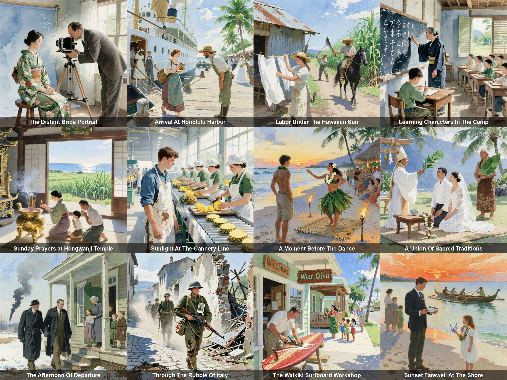

<p align="center">
  
</p>

# bayeux

*Created: 2025-11-15 · Last edited: 2026-04-19*

Build a Bayeux-tapestry-style image grid from a JSON of family-history paragraphs.

Given paragraphs like *"In the autumn of 1880, Tommaso and Lucia Ricci stepped off the steamship Canopic at Castle Garden…"*, Gemini 3.1 Flash Lite rewrites each into a visual prompt, Nunchaku Qwen-Image renders it at a chosen style, and the script assembles every panel into a single labeled, optionally seam-blended tapestry.

## Where the code lives

See [`tapestry/README.md`](tapestry/README.md) for the full schema (family JSONs × style JSONs), CLI flags, cache layout, panel-label and seam-blending options, and worked examples.

```bash
pip install -r requirements.txt

# Put NUNCHAKU_API_KEY and GEMINI_API_KEY in tapestry/.env.
set -a && source tapestry/.env && set +a

python -u tapestry/build_tapestry.py \
    tapestry/ricci-bradford-1880.json \
    --style tapestry/styles/rembrandt.json
```

## Layout

```
tapestry/              the tapestry app (main code)
  build_tapestry.py
  README.md
  *.json               family files: paragraphs + seed + grid
  styles/*.json        style files: one style_suffix per visual look
examples/python/       minimal API references the pipeline is built on
  text_to_image.py
  image_to_image.py
requirements.txt       deps for the tapestry app
```

Other directories (`demo/`, `tests/`, video/JS/cURL starters under `examples/`) are left over from the original Nunchaku starter kit. They are gitignored but kept on disk as a local reference.

## Publishing the gallery

Read-only public gallery is deployed via **Vercel** as a static site. The repo root contains:

```
public/         static site emitted by tapestry/build_gallery.py
vercel.json     CDN cache headers + cleanUrls
```

**Build the gallery locally:**

```bash
# Render whichever tapestries you want to publish (default --out-dir is cwd):
python -u tapestry/build_tapestry.py tapestry/ricci-bradford-1880.json \
    --style tapestry/styles/bayeux.json --full-blend --out-dir out

# Walk cache + rendered images, emit public/index.html + public/tapestries/*.jpg:
python tapestry/build_gallery.py --images-dir out
```

`build_gallery.py` picks the most-processed variant available per (family, style) — `-poisson` > `-blended` > raw — and embeds per-panel metadata (title, year, people, paragraph, generated prompt) as expandable `<details>` sections. Pure Python + Pillow; no JS toolchain.

Preview locally with `python -m http.server 8000 -d public` and open `http://localhost:8000`.

**Deploy to Vercel:**

```bash
npm i -g vercel   # one-time
vercel            # first time: link to a Vercel project
vercel --prod     # deploy
```

No serverless functions, no env vars on Vercel — it's just `public/`. API keys stay local. Re-run `build_tapestry.py` and `build_gallery.py`, git-commit `public/`, then `vercel --prod` (or push to a git-connected branch and let Vercel auto-deploy).

## Acknowledgements

This project began as Nunchaku's Python/cURL/JS starter kit and has been narrowed to the tapestry pipeline.
